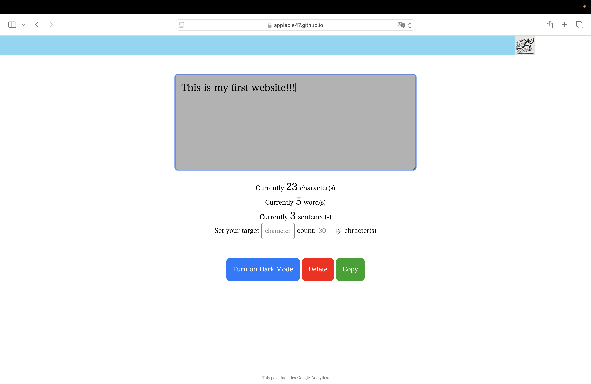
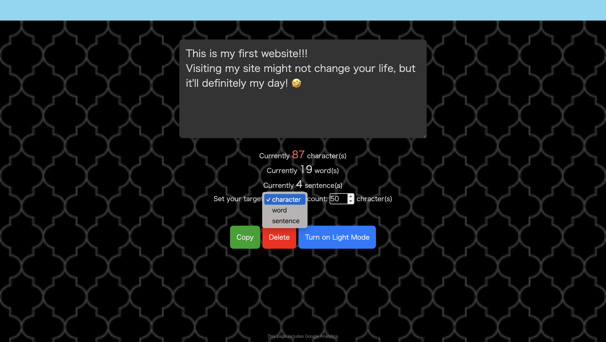

# Text Counter
Click [here](https://appleple47.github.io/Text-Counter/) to visit my website and count your text.
## About
On my website, you can count the length of your text.\
This repository is for my first website.\
I will make an effort to use English in this repository and on my website.\
Even if there is any strange English, please don't mind.\
If you have any ideas to improve my website, please let me know!\
The wallpapers are provided by [Subtle Patterns](https://www.toptal.com/designers/subtlepatterns/).\
By the way, "RunningMan.png" was generated by [ChatGPT](https://chatgpt.com/g/g-8sPlJ64Gn-tiyatutogpt).

## How to use 
Type your text into the gray textbox, and it will automatically count your characters, words and sentences.\
If you set your target type of count and target count, Running Man at the top of my page will show you your progress.\
The copy button lets you copy your text to the clipboard.\
The paste button allows you to insert text from your clipboard.\
To delete your typed sentences, press the delete button.\
You can switch between light and dark mode by pressing the toggle button.

## Future Plans
・Add a word and sentence count feature (completed on 24 Jan 2025)\
・Allow switching target count type (competed on 25 Jan 2025)\
・Add a wallpaper to the page (completed on 27 Jan 2025)\
・Activate word and sentence counters (completed on 28 Jan 2025)\
・Add a sharing button\
・Add a paste button (completed on 28 Jan 2025) \
・Make my site show up in search results!\
・Add ads, lol\
・Utilize Google Analytics Data to improve my site\
・Get some feedback\
  etc.

## Reference(s) and Citation(s)
[1] Mana, 2023, "[1冊ですべて身につくJavaScript入門講座](https://www.sbcr.jp/product/4815615758/)", SB Creative\
[2] Toptal>Utilities>Subtle Patterns https://www.toptal.com/designers/subtlepatterns/ \

