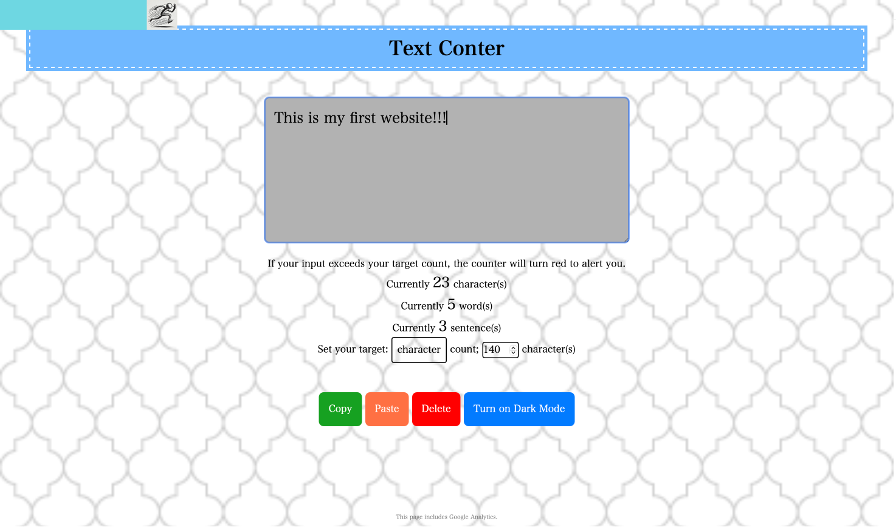
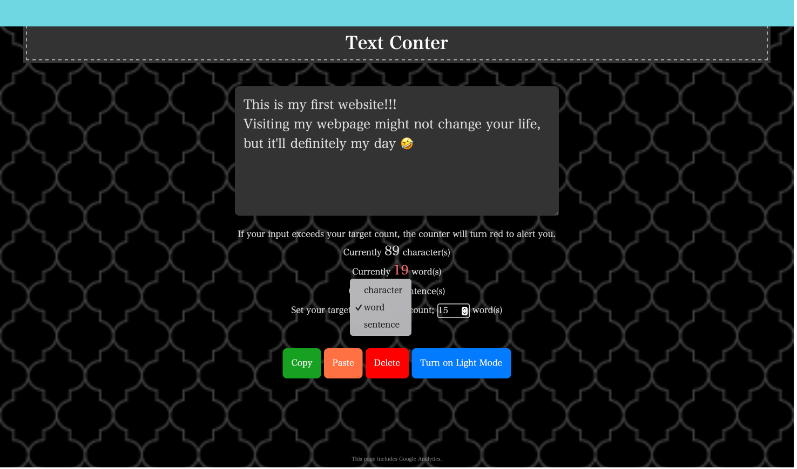

# Text Counter
[Click here to visit the website.](https://appleple47.github.io/Text-Counter/)\
Sorry, the word and sentence counters aren't working right now, but I’m working on fixing them. (25 Jan 2025)\
P.S.: The issue has been resolved as of 28 Jan 2025.

## About
On the website, you can count the length of your text.\
This repository is for my first website.\
I will make an effort to use English in this repository.\
Even if there is any strange English, please don't mind.\
If you have any ideas to improve this website, please let me know!\
Wallpapers are provided by [Subtle Patterns](https://www.toptal.com/designers/subtlepatterns/).\
By the way, "RunningMan.png" was generated by [ChatGPT](https://chatgpt.com/g/g-8sPlJ64Gn-tiyatutogpt).

## How to use 
Type your sentence into the gray textbox, and it will automatically count your characters, words and sentences.\
If you set your target character count, the running boy at the top will show you your progress.\
The copy button lets you copy your text to the clipboard.\
To delete your typed sentences, press the delete button.\
You can switch light/dark mode by pressing the toggle button.

## Future Plans
・Add a word and sentence count feature (completed on 24 Jan 2025)\
・Allow switching target count type (competed on 25 Jan 2025)\
・Add a wallpaper to the page (completed on 27 Jan 2025)\
・Activate word and sentence counters (completed on 28 Jan 2025)\
・Add a sharing button\
・Add a paste button (completed on 28 Jan 2025) \
・Add ads, lol\
・Utilize Google Analytics Data to improve the Website\
・Get some feedback\
  etc.

## Reference and Citation
[1] Mana, 2023, "[1冊ですべて身につくJavaScript入門講座](https://www.sbcr.jp/product/4815615758/)", SB Creative\
[2] https://www.toptal.com/designers/subtlepatterns/ \

